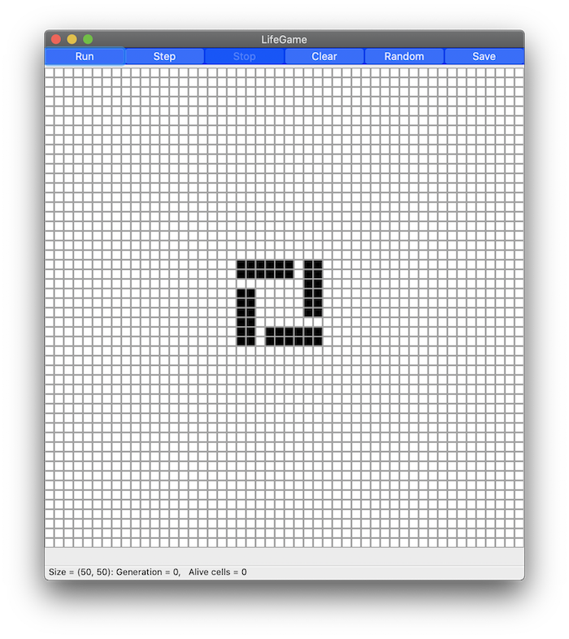

# LifeGame on Python

 
   
You can simulate Conway's Game of Life simply on Python!!  

## What is Conway's Game of Life?

My article: [GUIのライフゲームを作ってみた【Python】| HIRO LAB BLOG](https://hirlab.net/nblog/category/programming/art_616/)
  
(en) [Conway's Game of Life - Wikipedia](https://en.wikipedia.org/wiki/Conway%27s_Game_of_Life)  
(jp) [ライフゲーム - Wikipedia](https://ja.wikipedia.org/wiki/ライフゲーム)  

## Install
```bash
$ python setup.py install
```

## Simple TestCase
```bash
$ python setup.py test
```

## Examples
The code of [main.py](main.py)
```python
from lifegame import GUILifeGame, obj


if __name__ == '__main__':

    # Create Conway's Game of Life GUI Frame
    game = GUILifeGame(f_shape=(100, 100), time_step=10)

    # Put Galaxy on center
    game.set_object(obj.GALAXY)

    # Start!!
    game.run()

```


## LICENSE
[MIT LICENSE](LICENSE.txt)  
Copyright (c) 2020 Hiroshi ARAKI